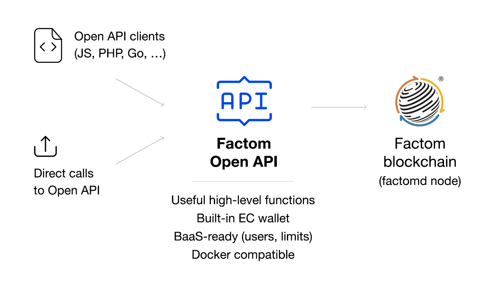

# Factom Open API

Factom Open API is a lightweight REST API for the Factom blockchain. It connects to an existing factomd node and has a built-in Factom wallet that will handle signing data before writing it to the Factom blockchain.

## Main features

- **Instant start:** use Open API immediately after installation
- **Write data** to the blockchain at a **fixed cost** (**\$1 for 1000 entries** of 1 KB)
- **BaaS-ready:** user-based API access, counting usage, limits
- **Read all chain entries at once** using a single request (no need to read all entry blocks of chain one by one)
- **Search chains & entries** by tags (external IDs)
- **Pagination, sorting, filtering** results with query params
- **Generic factomd interface:** all factomd API requests are supported via special REST path

## API Reference

### Documentation

- Documentation on Gitbook: https://docs.openapi.de-facto.pro
- Built-in Swagger specification: `http://<factom_open_api_server_ip_and_port>/docs/index.html`

### Methods

- **Chains**
  - <a href="https://docs.openapi.de-facto.pro/chains/create-chain" target="_blank">POST /chains</a> – _Create chain_
  - <a href="https://docs.openapi.de-facto.pro/chains/get-chains" target="_blank">GET /chains</a> – _Get user's chains_
  - <a href="https://docs.openapi.de-facto.pro/chains/search-chains" target="_blank">POST /chains/search</a> – _Search user's chains by ExtIDs_
  - <a href="https://docs.openapi.de-facto.pro/chains/get-chain" target="_blank">GET /chains/:chainId</a> – _Get chain by ChainID_
  - <a href="https://docs.openapi.de-facto.pro/chains/get-chain-entries" target="_blank">GET /chains/:chainId/entries</a> – _Get chain entries_
  - <a href="https://docs.openapi.de-facto.pro/chains/get-chain-first-entry" target="_blank">GET /chains/:chainId/entries/first</a> – _Get first entry of chain_
  - <a href="https://docs.openapi.de-facto.pro/chains/get-chain-last-entry" target="_blank">GET /chains/:chainId/entries/last</a> – _Get last entry of chain_
  - <a href="https://docs.openapi.de-facto.pro/chains/search-chain-entries" target="_blank">POST /chains/:chainId/entries/search</a> – _Search entries in chain by ExtIDs_
- **Entries**
  - <a href="https://docs.openapi.de-facto.pro/entries/create-entry" target="_blank">POST /entries</a> – _Create entry in chain_
  - <a href="https://docs.openapi.de-facto.pro/entries/get-entry" target="_blank">GET /entries/:entryHash</a> – _Get entry by EntryHash_
- **Generic**
  - <a href="https://docs.openapi.de-facto.pro/factomd/factomd-method" target="_blank">POST /factomd/:method</a> – _Generic factomd interface_
- **Info**
  - <a href="https://docs.openapi.de-facto.pro/user/get-user" target="_blank">GET /user</a> – _Get user info_
  - <a href="https://docs.openapi.de-facto.pro/api/api-info" target="_blank">GET /</a> – _Get API info_

## Installation guides

- 🐳 <a href="https://github.com/DeFacto-Team/Factom-Open-API/blob/master/guides/INSTALL_DOCKER.md">Install with Docker</a>
- 🛠 <a href="https://github.com/DeFacto-Team/Factom-Open-API/blob/master/guides/INSTALL_BINARY.md">Install with binaries</a>

## Clients

- <a href="https://github.com/DeFacto-Team/Factom-Open-API-PHP" target="_blank">PHP</a>

### Swagger auto-generated clients (beta)
Factom Open API follows Swagger 2.0 specification. 
Auto-generated clients:
- <a href="https://github.com/DeFacto-Team/FOA-Swagger-python" target="_blank">Python</a>
- <a href="https://github.com/DeFacto-Team/FOA-Swagger-nodejs" target="_blank">Node.js</a>

## Design

### Fetching updates

Factom Open API does not store _all chains_ of the Factom blockchain in its local database. Instead, when you start working with a chain using any request (get entry of chain, get chain info, write entry into chain, etc...), the chain is fetched from Factom in the background.
  
All fetched chains are stored in the local DB, and new entries are added automatically in minute 0-1 of each block.
  
**This allows Factom Open API to be used immediately after installing without a long syncing period with Factom blockchain.** It is not designed for applications which require _all_ chains, blocks and entries - e.g. a Factom Explorer.

### User's chains

A great advantage of Factom Open API is binding chains to API users. This binding is stored locally in the Open API database. It's possible to show users _their chains_, including ones the user created and all chains that the user has worked with (write, read or search).  
This way API users may search their specific chains by External ID(s) instead of searching the entire blockchain.

### 

## License
Factom Open API is released under the MIT License.
